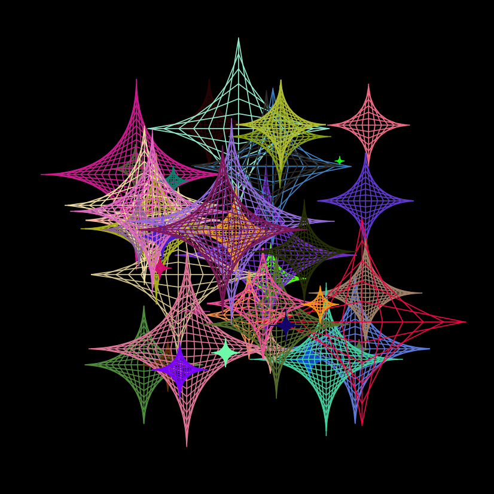
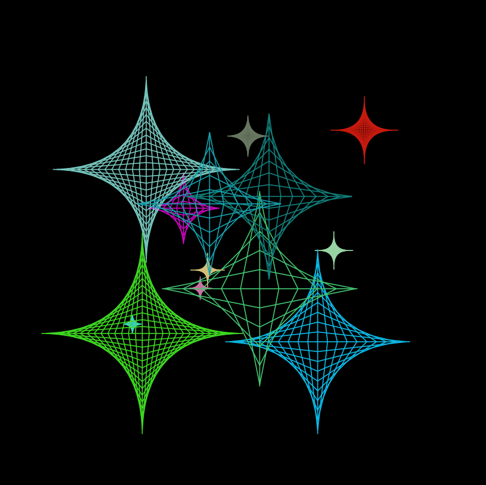

# SVG String Art Generator

This project generates SVG (Scalable Vector Graphics) images resembling string art, specifically creating patterns that look like diamond or star shapes. The C program utilizes basic geometric principles to draw lines that form these intricate designs within an HTML file.

## Features

* **Randomized Shapes:** Generates a random number of diamond/star shapes in each run.
* **Dynamic Positioning and Sizing:** Each shape has a random position, line length, and line count, contributing to unique patterns.
* **Vibrant Colors:** Shapes are drawn with randomly generated RGB colors.
* **SVG Output:** Creates an `svg.html` file that can be opened in any web browser to view the generated artwork.

## How it Works

The C program `main.c`:

1.  Initializes a random seed based on the current time to ensure different outputs each time it's run.
2.  Opens `svg.html` for writing, redirecting `stdout` to this file.
3.  Sets up an SVG canvas within an HTML document with a black background.
4.  Generates a random number of shapes (between 5 and 54).
5.  For each shape:
    * Determines a random RGB color, position (within a central 500x500 area of a 1000x1000 canvas), line length, and the number of lines to draw for that shape.
    * Draws a horizontal and a vertical line as the base of the shape.
    * Uses a `while` loop to draw a series of connecting lines that create the parabolic curve effect, forming the diamond/star shape.
6.  Closes the SVG and HTML tags.

## Examples

Below are examples of the output generated by this program:

|  |  |
| :---------------------------------: | :---------------------------------: |
|           A dense collection          |          Fewer, larger shapes         |